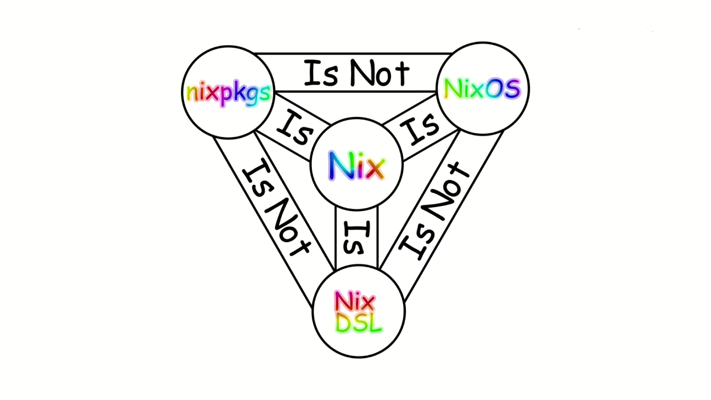

<div align="center">
  
</div>

# Foo's Nix & NixOS Configuration

> [!IMPORTANT]
> This repository contains my NixOS setup with Home Manager and Flakes. While it isn't fully modular yet, it is mostly functional and **Just Works**. I plan to eventually develop it to a fully modular system and avoid unnecessary complexity to maintain readability in the codebase.
>
> Feel free to use it as reference for your own configurations.
>
> Albeit the setup isn't perfect, I hope it can provide some useful insights as I add informational comments wherever possible.

**Consider creating an issue addressing a problem or suggestions for improvement; otherwise, feel free to submit a pull request.**

## Directory structure (at a glance)

```txt
.
├── flake.nix
├── hosts
│   └── foobar
└── modules
    ├── environment
    │   ├── packages
    │   ├── programs
    │   ├── services
    │   └── users
    │       └── foo
    │           └── home-depot
    │               ├── packages
    │               ├── programs
    │               └── services
    ├── foundations
    │   ├── bootloader
    │   │   └── systemd-boot
    │   ├── graphics
    │   │   ├── api
    │   │   │   └── opengl
    │   │   └── processing-units
    │   │       ├── amd
    │   │       └── nvidia
    │   ├── i18n
    │   │   ├── fonts
    │   │   └── l10n
    │   ├── internet
    │   └── kernel
    └── peripherals
        ├── audio
        ├── bluetooth
        └── tablet
```

Currently, all OS and Home Manager modules are imported within `/hosts/foobar/systemwide.nix` and `/hosts/foobar/userspace.nix` explicitly. These two files are ideally intended to be used as module switches or toggles if you will, for `/modules`. `/modules/users/foo/home-depot/` directory serves as a deposit for the user's home configurations managed by Home Manager.

## Acknowledgements

Nix and NixOS differs from traditional distributions and thus has a learning curve. One has to step out of their comfort zone but if able to learn, it's greatly benefiting. Same philosophy can apply for everything else in life.

With that said, I'd like to thank:

- [Tanvir](https://github.com/TanvirOnGH), his invaluable guidance enabled me to make the hop to Nix & NixOS (from Arch, btw) and to come up with an initial setup. [His own Nix/NixOS ](https://github.com/TanvirOnGH/nixos-config) configuration has been incredibly helpful in creating mine.
- [Krey](https://github.com/Kreyren/nixos-config), [Fufezan](https://github.com/fufexan/dotfiles), and [Ryan Yin](https://github.com/ryan4yin/nix-config) for their repositories, which were indispensable sources of learning and reference.
- [NixOS Discourse](https://discourse.nixos.org/), official NixOS community forum that helped me debug hours of pure pain.

## The holy trinity of Nix

<div>
  
</div>
